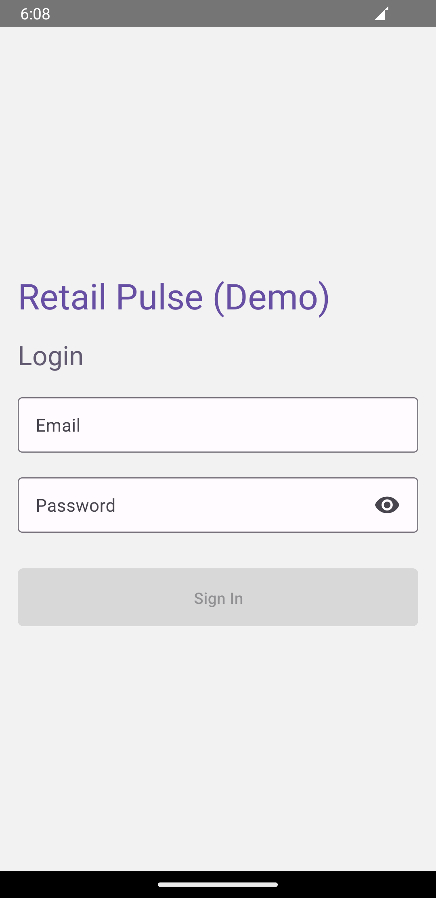
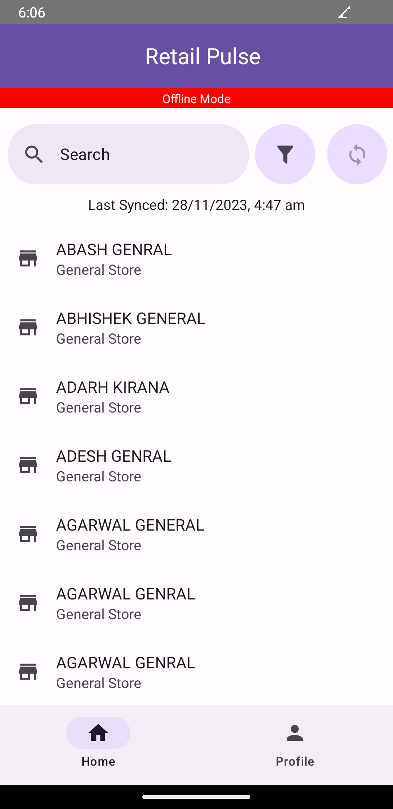
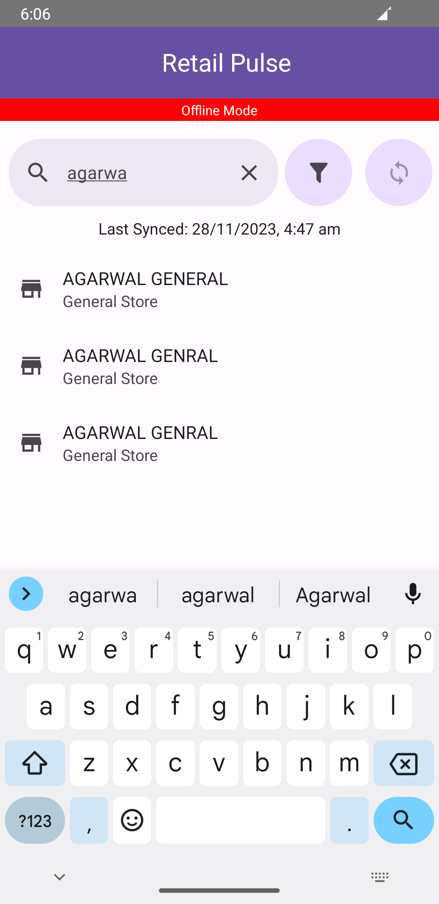
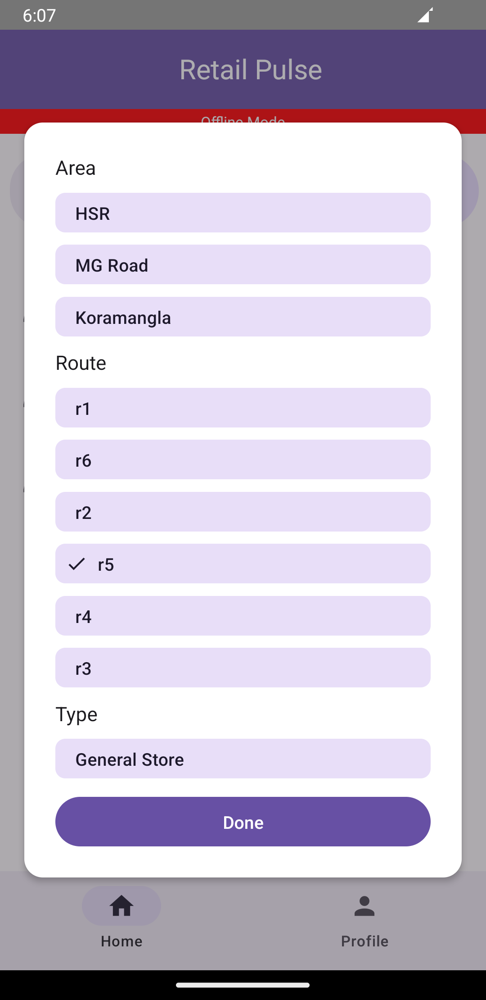
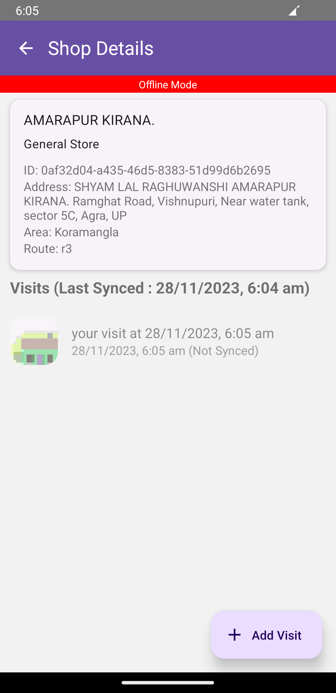
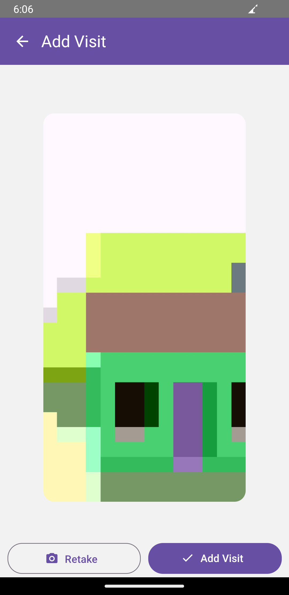
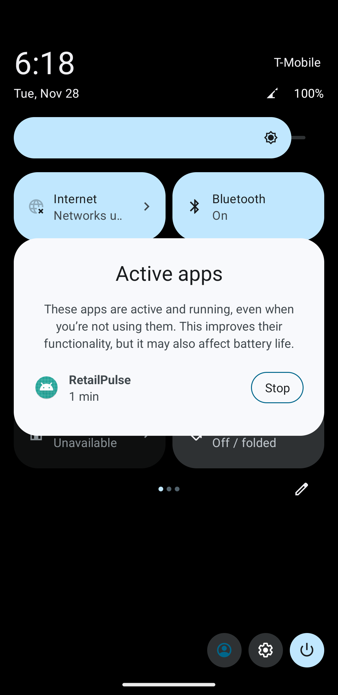

# Retail Pulse - React Native App


## Overview

Retail Pulse is a React Native mobile application designed to collect images from stores and upload them to cloud storage. This app serves as an demo to streamline the process for grocery store visits.

## Features [v0.0.1]

- **User Authentication:** Login with your email and password to access the app.
- **Store Management:** View your stores and filter with search and wide range of filters.
- **Image Capture and Upload:** Record your store visits with an image.
- **Offline Support:** Runs in background and waits for you to connect to internet to upload.
- **Multiple Image Upload:** All images you click while offline will be queued for upload when you are back online.

## Screenshots

### Login Screens




### Store List and Search





### Image Capture and Upload




### Sync and Offline Support



## How to Run

1. Clone the repository: `git clone https://github.com/KunalGhosh02/RetailPulse.git`


2. - In the Firebase Console, click on "Add app" and select the Android icon.
   - Enter your Android package name (usually located in `android/app/build.gradle`).
   - Download the `google-services.json` file and place it in the `android/app` directory of your React Native project.


3. Add dummy store data under `users/${userId}/stores/` with the following schema:
     ```json
     {
         "type": "Dummy Store",
         "name": "FAKEMART",
         "route": "route66",
         "area": "Radiator Springs",
         "address": "Fake Street, IN 12345"
     }
     ```
     Replace `userId` with the actual user ID.


4. Install dependencies: `npm install`


5. Run the app: `npx react-native run-android`

> **_NOTE:_**  Android home environment variables must be set. See [React Native - Environment Setup](https://reactnative.dev/docs/environment-setup) for more details.